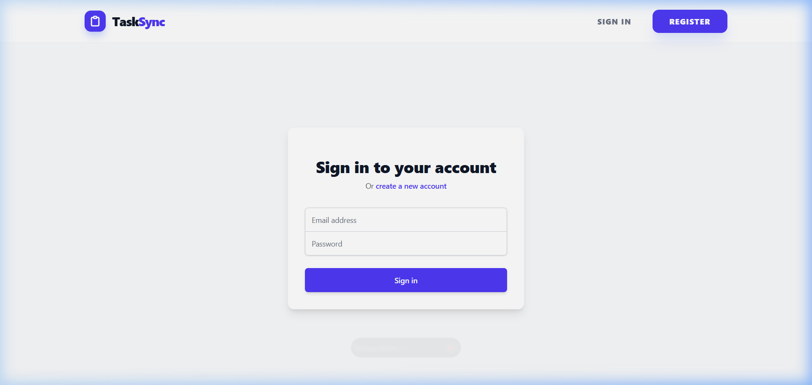
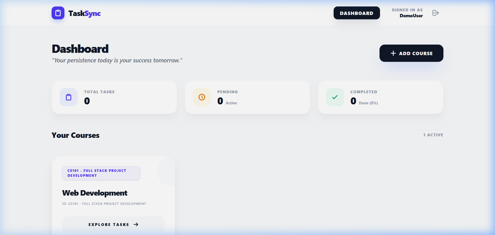
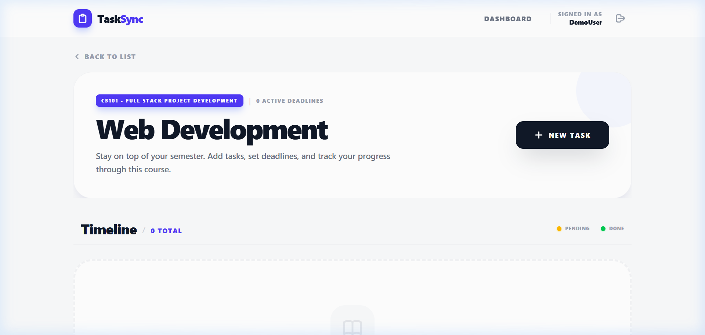
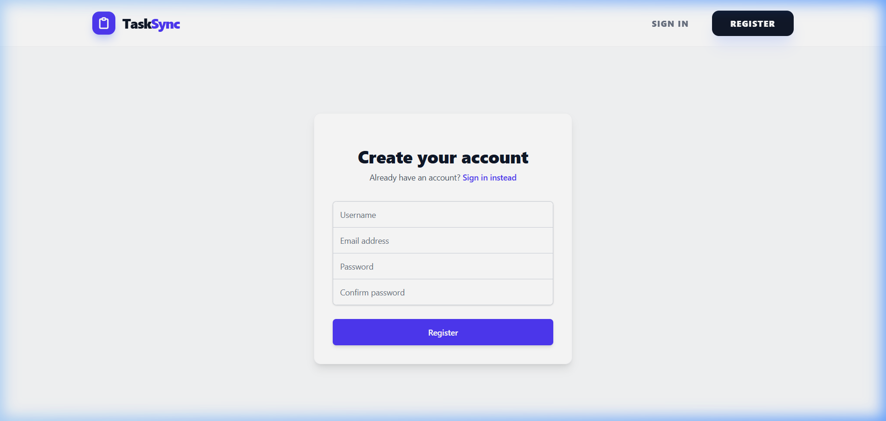

# 🚀 TaskSync | Student Task & Deadline Manager

[](https://student-task-deadline-manager.vercel.app)
[-blue.svg)](https://reactjs.org/)
[](https://nodejs.org/)
[](https://www.mysql.com/)
[](https://opensource.org/licenses/MIT)

**TaskSync** is a professional, full-stack web application designed to help students organize their academic life. It provides a centralized hub for managing courses, tracking deadlines, and storing study materials, all within a beautiful, responsive interface.

[Live Demo](https://student-task-deadline-manager.vercel.app) • [Backend API](https://student-task-deadline-manager.onrender.com)

---

## ✨ Features

- **🎯 Intelligent Dashboard**: Overview of pending deadlines and course progress at a glance.
- **📚 Course Discovery & Management**: Organize your semester by individual subjects.
- **✅ Smart Task Tracking**: Comprehensive task list with due dates, search filters, and progress toggles.
- **📎 Course Materials**: Securely upload and manage syllabus, lecture notes, and references for every subject.
- **🌓 Adaptive Theme**: Seamless Dark Mode for late-night study sessions.
- **📱 Mobile First**: Fully responsive design that works perfectly on any device.
- **🔐 Secure Auth**: Robust security using JWT (JSON Web Tokens) and Bcrypt hashing.

---

## 📸 Screenshots

| Login Page | Dashboard |
|:---:|:---:|
|  |  |

| Tasks List | Register |
|:---:|:---:|
|  |  |

---

## 🛠️ Tech Stack

### Frontend
- **Framework**: React 18 (Vite)
- **Styling**: Tailwind CSS 4.0
- **State management**: Context API
- **Routing**: React Router 6
- **Notifications**: React Hot Toast

### Backend
- **Runtime**: Node.js
- **Framework**: Express.js
- **Database**: MySQL (Managed via PlanetScale/Render)
- **Security**: JWT & Bcrypt.js
- **Validation**: Joi
- **File Handling**: Multer

---

## ⚙️ Local Development

### 1. Prerequisites
- **Node.js** (v18+)
- **MySQL** (v8+)

### 2. Database Setup
```sql
CREATE DATABASE student_manager;
USE student_manager;
-- Run backend/database/schema.sql to initialize tables
```

### 3. Installation
```bash
# Clone the repository
git clone https://github.com/shamshad0003/Student-Task-Deadline-Manager.git
cd Student-Task-Deadline-Manager

# Install dependencies (Root, Backend, and Frontend)
npm install
cd backend && npm install
cd ../frontend && npm install
```

### 4. Environment Variables
**Backend (.env)**
```env
PORT=5000
DB_HOST=localhost
DB_USER=your_username
DB_PASSWORD=your_password
DB_NAME=student_manager
JWT_SECRET=your_super_secret_key
FRONTEND_URL=http://localhost:5173
```

**Frontend (.env)**
```env
VITE_API_URL=http://localhost:5000/api
```

### 5. Running the App
**Start Backend:**
```bash
cd backend
npm start
```

**Start Frontend:**
```bash
cd frontend
npm run dev
```

---

## 📡 API Endpoints

| Endpoint | Method | Description |
|:---|:---|:---|
| `/api/auth/register` | POST | Create a new student account |
| `/api/auth/login` | POST | Authenticate and get JWT |
| `/api/courses` | GET/POST | List and create courses |
| `/api/tasks` | GET/POST | Manage deadlines and tasks |
| `/api/files` | POST/GET | Upload/retrieve course materials |

---

## 🚀 Future Roadmap
- [ ] **Email Reminders**: Automated alerts 24h before deadlines.
- [ ] **Calendar View**: Visual monthly timeline of all tasks.
- [ ] **Study Groups**: Shared course folders for collaboration.
- [ ] **Progress Analytics**: Graphed performance across different subjects.

---

## 👨‍💻 Author
**Shamshad**
- GitHub: [@shamshad0003](https://github.com/shamshad0003)

---

## 📜 License
This project is licensed under the MIT License - see the [LICENSE](LICENSE) file for details.
