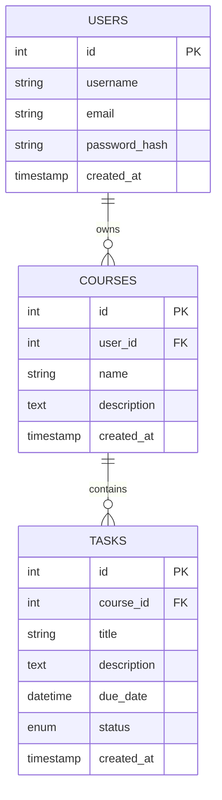

# Data Structure: Student Task Deadline Manager

This document describes the entities, fields, and relationships in the Student Task Deadline Manager application.

## Entities

### Users
Represents the students using the application.

| Field | Type | Description |
| :--- | :--- | :--- |
| `id` | `INT` | Primary Key, Auto-increment. |
| `username` | `VARCHAR(255)` | Unique username. |
| `email` | `VARCHAR(255)` | Unique email address. |
| `password_hash` | `VARCHAR(255)` | Hashed password. |
| `created_at` | `TIMESTAMP` | Record creation time. |

### Courses
Represents the courses a student is enrolled in.

| Field | Type | Description |
| :--- | :--- | :--- |
| `id` | `INT` | Primary Key, Auto-increment. |
| `user_id` | `INT` | Foreign Key referencing `users(id)`. |
| `name` | `VARCHAR(255)` | Name of the course. |
| `description` | `TEXT` | Optional course description. |
| `created_at` | `TIMESTAMP` | Record creation time. |

### Tasks
Represents the assignments or deadlines within a course.

| Field | Type | Description |
| :--- | :--- | :--- |
| `id` | `INT` | Primary Key, Auto-increment. |
| `course_id` | `INT` | Foreign Key referencing `courses(id)`. |
| `title` | `VARCHAR(255)` | Title of the task. |
| `description` | `TEXT` | Optional task description. |
| `due_date` | `DATETIME` | The deadline for the task. |
| `status` | `ENUM` | 'pending' or 'completed'. |
| `created_at` | `TIMESTAMP` | Record creation time. |

## Relationships

- **User to Course**: 1:N (A user can have multiple courses).
- **Course to Task**: 1:N (A course can have multiple tasks).
- **User to Task**: Indirect relationship via Course.

